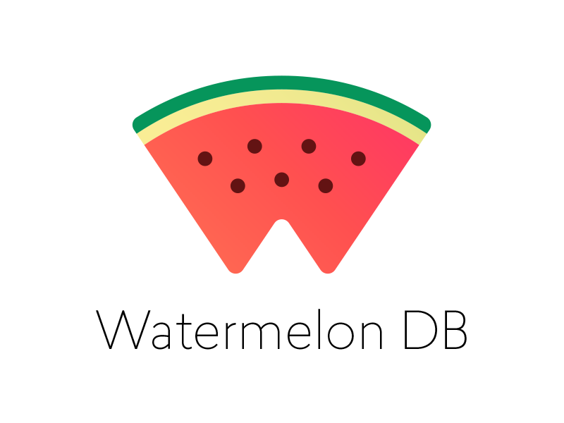

  

## Options (Offline Mode) 📴

<table>
  <tr>
    <td>
      
    </td>
    <td>
      
    </td>
  </tr>
</table>

## Credits 👍

- **React Native Template TypeScript:** [👾 Clean and minimalist React Native template for a quick start with TypeScript.](https://github.com/react-native-community/react-native-template-typescript)

## Happy coding 💯

Made with ❤️
